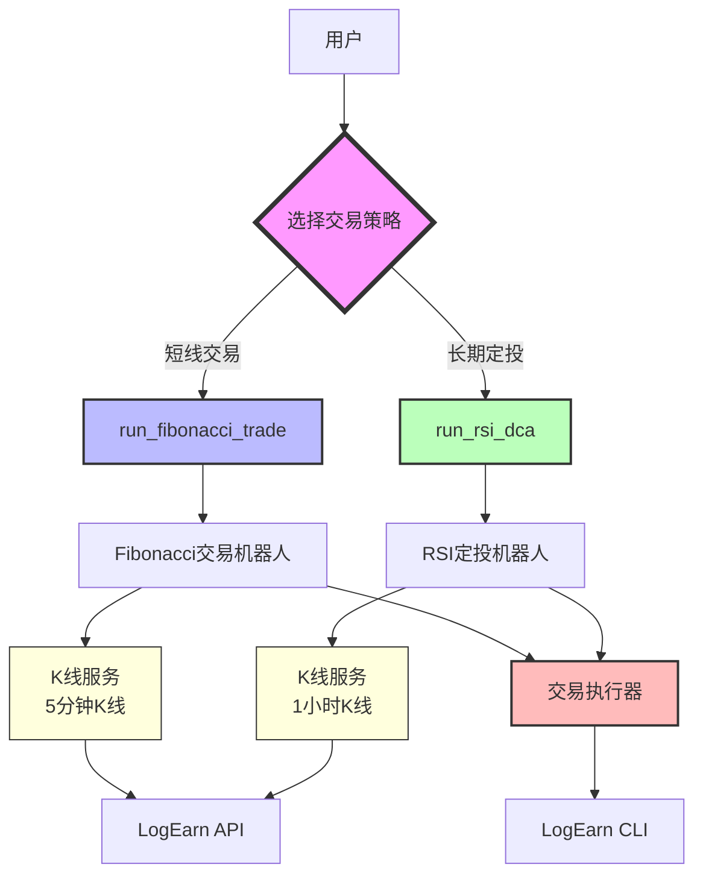
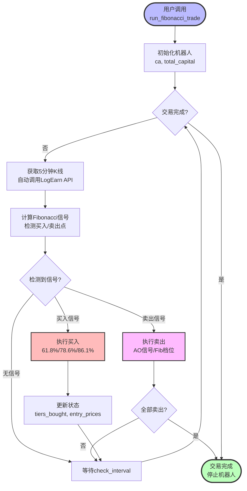
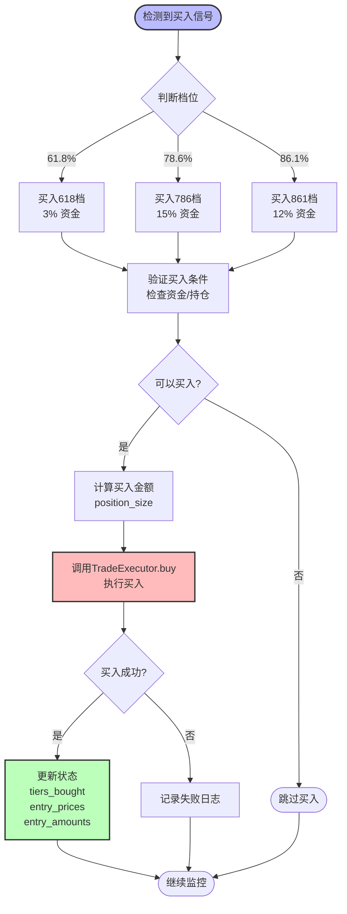
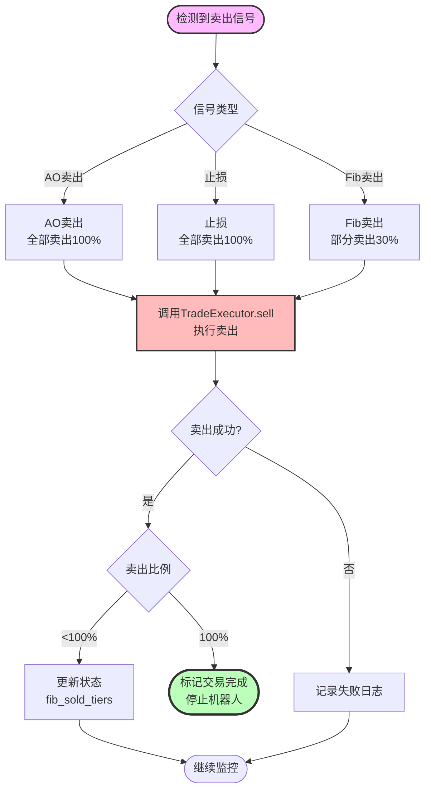
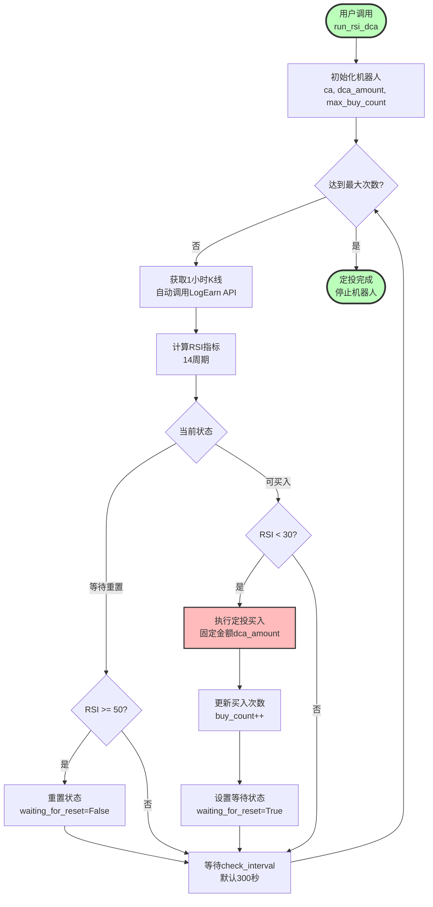
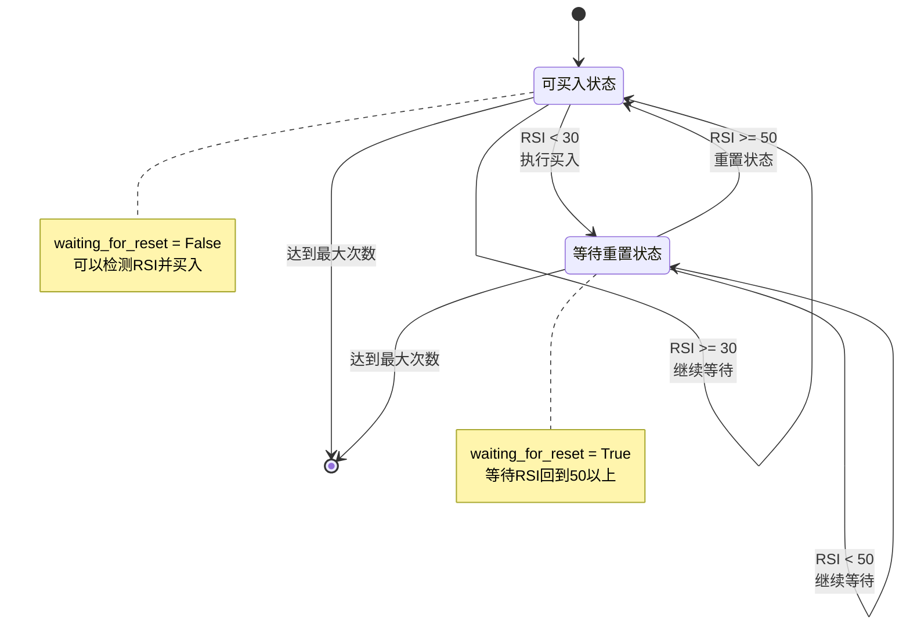
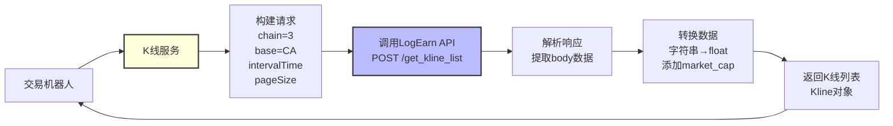
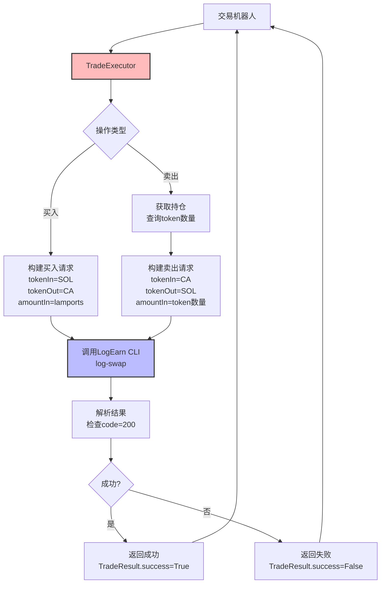

# 主要功能流程图

## 概述

本项目对外提供**2个核心交易接口**，内部自动处理K线获取和交易执行。

---

## 🎯 整体架构



---

## 📊 流程1: Fibonacci交易

### 1.1 整体流程



### 1.2 买入流程详解



### 1.3 卖出流程详解



---

## 📈 流程2: RSI定投

### 2.1 整体流程



### 2.2 状态机



### 2.3 买入时机示例

```
时间轴：
  ↓
RSI=28 < 30 → 买入（1/10）→ waiting_for_reset=True
  ↓
RSI=35 < 50 → 继续等待
  ↓
RSI=45 < 50 → 继续等待
  ↓
RSI=52 >= 50 → 重置状态 → waiting_for_reset=False
  ↓
RSI=55 >= 30 → 继续等待
  ↓
RSI=29 < 30 → 买入（2/10）→ waiting_for_reset=True
  ↓
...
  ↓
买入（10/10）→ 停止
```

---

## 🔧 内部模块交互

### 3.1 K线服务流程



### 3.2 交易执行流程



---

## 📋 数据流

### 4.1 Fibonacci交易数据流

```
用户输入
  ↓
ca: "代币地址"
total_capital: 2.0 SOL
check_interval: 60秒
  ↓
K线服务
  ↓
5分钟K线数据 (200根)
  ↓
Fibonacci计算
  ↓
买入信号: {action: "buy_618", price: 0.00005, tier: "618"}
  ↓
仓位管理
  ↓
买入金额: 0.06 SOL (3%)
  ↓
交易执行
  ↓
LogEarn CLI
  ↓
交易结果: {success: true, code: 200}
  ↓
状态更新
  ↓
tiers_bought: ["buy_618"]
entry_prices: {"buy_618": 0.00005}
entry_amounts: {"buy_618": 1200}
```

### 4.2 RSI定投数据流

```
用户输入
  ↓
ca: "代币地址"
dca_amount: 0.1 SOL
max_buy_count: 10
  ↓
K线服务
  ↓
1小时K线数据 (200根)
  ↓
RSI计算
  ↓
RSI值: 28.5
  ↓
判断逻辑
  ↓
RSI < 30 → 触发买入
  ↓
交易执行
  ↓
买入0.1 SOL
  ↓
状态更新
  ↓
buy_count: 1
waiting_for_reset: True
  ↓
继续监控
  ↓
等待RSI >= 50
```

---

## 🎯 关键决策点

### 5.1 Fibonacci交易决策树

```
获取K线
  ↓
计算Fibonacci档位
  ↓
检测信号
  ├─ 价格回撤到61.8% → 买入3%
  ├─ 价格回撤到78.6% → 买入15%
  ├─ 价格回撤到86.1% → 买入12%
  ├─ AO零轴上方绿转红 → 全部卖出
  ├─ 收益率>50% → 全部卖出
  ├─ 价格突破Fib档位 → 部分卖出30%
  └─ 跌破止损价 → 全部卖出
```

### 5.2 RSI定投决策树

```
获取K线
  ↓
计算RSI
  ↓
检查状态
  ├─ waiting_for_reset=False
  │   ├─ RSI < 30 → 买入 → 设置waiting_for_reset=True
  │   └─ RSI >= 30 → 继续等待
  └─ waiting_for_reset=True
      ├─ RSI >= 50 → 重置状态 → 设置waiting_for_reset=False
      └─ RSI < 50 → 继续等待
```

---

## 🔄 完整生命周期

### Fibonacci交易完整周期

```
1. 启动
   ↓
2. 初始化机器人
   ↓
3. 进入监控循环
   ├─ 获取5分钟K线
   ├─ 计算Fibonacci信号
   ├─ 检测买入信号 → 分批买入
   ├─ 检测卖出信号 → 分批卖出
   └─ 等待60秒
   ↓
4. 全部卖出
   ↓
5. 标记交易完成
   ↓
6. 停止机器人
```

### RSI定投完整周期

```
1. 启动
   ↓
2. 初始化机器人
   ↓
3. 进入监控循环
   ├─ 获取1小时K线
   ├─ 计算RSI
   ├─ RSI < 30 → 买入 → 等待重置
   ├─ RSI >= 50 → 重置状态
   └─ 等待300秒
   ↓
4. 达到最大次数
   ↓
5. 停止机器人
```

---

## 📊 总结

### 对外接口（2个）

1. **`run_fibonacci_trade(ca, total_capital, check_interval)`**
   - 短线交易
   - 5分钟K线
   - Fibonacci + AO策略

2. **`run_rsi_dca(ca, dca_amount, max_buy_count, check_interval)`**
   - 长期定投
   - 1小时K线
   - RSI策略

### 内部模块（自动处理）

1. **K线服务** - 自动获取K线数据
2. **技术指标** - 自动计算RSI、Fibonacci
3. **交易执行** - 自动调用LogEarn CLI
4. **状态管理** - 自动管理交易状态

### 核心优势

- ✅ **简单** - 只需传递CA地址
- ✅ **自动** - K线获取、交易执行全自动
- ✅ **可靠** - 完整的错误处理和日志
- ✅ **灵活** - 支持多种策略和参数配置
