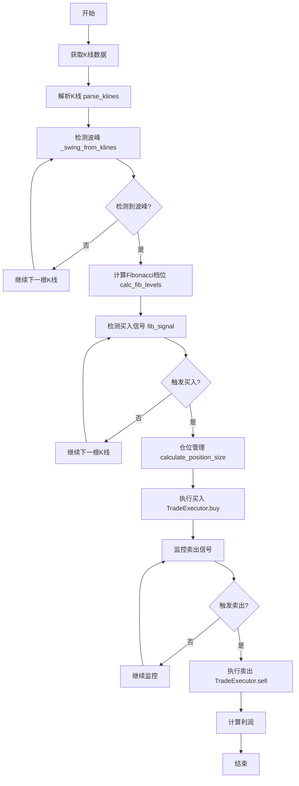
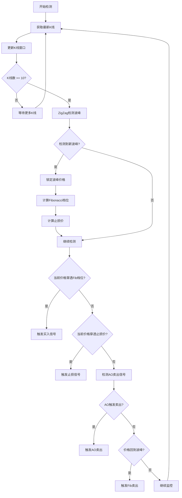
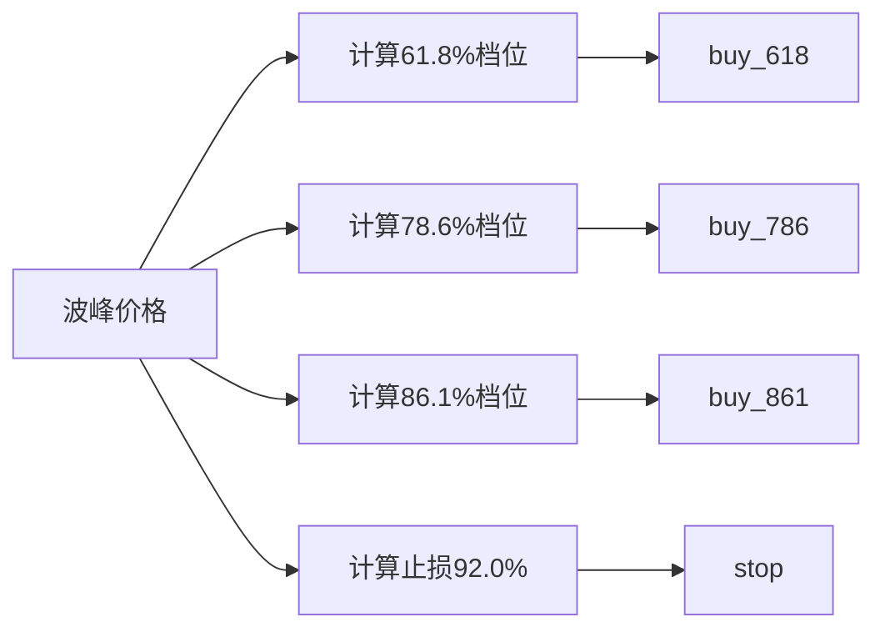
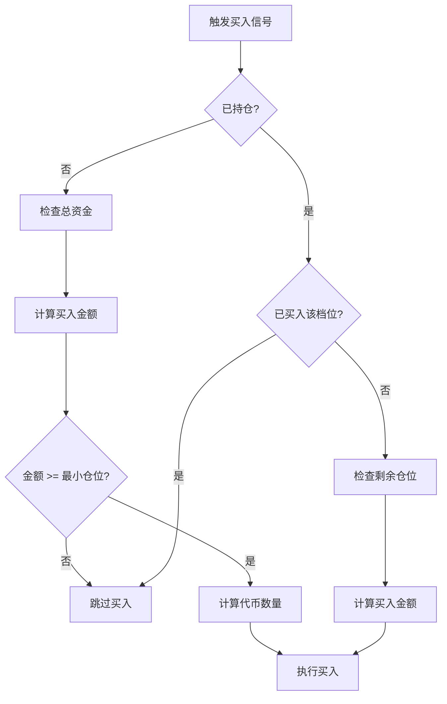
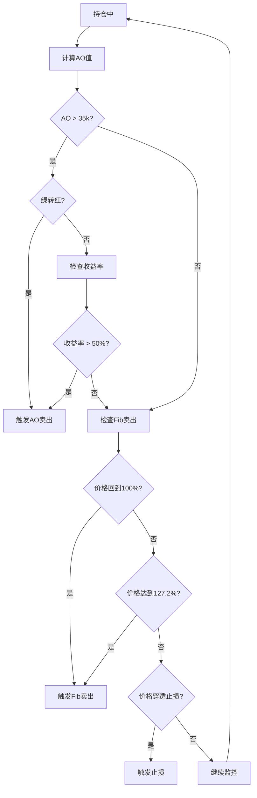
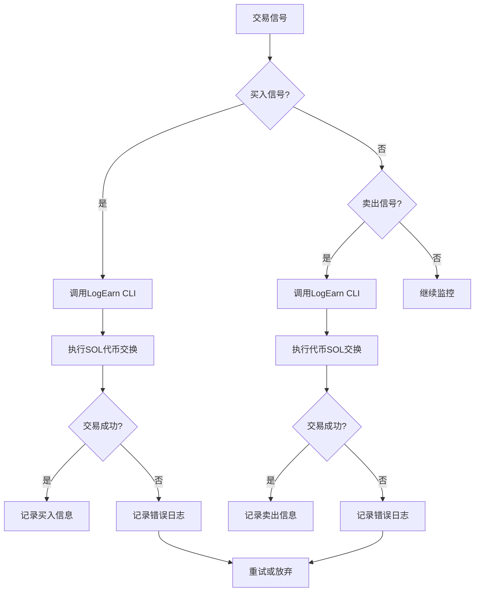

# 核心交易逻辑流程图

## 整体流程



## 详细流程

### 1. 信号检测流程



### 2. Fibonacci档位计算



### 3. 仓位管理流程



### 4. 卖出信号检测



### 5. 真实交易执行流程



## 核心模块说明

### 1. fib_calculator.py
- **功能**: Fibonacci回撤计算和信号检测
- **核心函数**:
  - `parse_klines`: 解析原始K线数据
  - `_swing_from_klines`: ZigZag检测波峰波谷
  - `calc_fib_levels`: 计算Fibonacci档位
  - `fib_signal`: 检测买入/卖出信号

### 2. position_manager.py
- **功能**: 仓位管理和买入金额计算
- **核心函数**:
  - `calculate_position_size`: 计算买入金额
  - `check_can_buy`: 检查是否可以买入
  - `check_trading_hours`: 检查交易时间窗口

### 3. profit_manager.py
- **功能**: 利润管理和卖出信号检测
- **核心函数**:
  - `check_profit_target`: 检查利润目标
  - `check_ao_sell_signal`: 检测AO卖出信号
  - `check_stop_loss`: 检查止损

### 4. executor.py
- **功能**: 真实交易执行
- **核心函数**:
  - `buy`: 执行买入操作
  - `sell`: 执行卖出操作
  - `_logearn_swap`: 调用LogEarn CLI进行交易

### 5. trade_checker.py
- **功能**: 交易检测和过滤
- **核心函数**:
  - `check_single_trade`: 检测单次交易
  - `filter_klines_by_market_cap`: 市值过滤

### 6. win_rate_analyzer.py
- **功能**: 胜率分析和多次交易分析
- **核心函数**:
  - `analyze_token_trades`: 分析多次交易
  - `split_trades_by_sell_points`: 分割交易周期

## 数据流向

```
K线数据 → parse_klines → Kline对象
                ↓
        filter_klines_by_market_cap (可选)
                ↓
        _swing_from_klines (ZigZag)
                ↓
        calc_fib_levels (Fibonacci档位)
                ↓
        fib_signal (信号检测)
                ↓
        calculate_position_size (仓位管理)
                ↓
        TradeExecutor (真实交易执行)
                ↓
        ProfitManager (利润管理)
```

## 关键参数

### Fibonacci配置
- **买入档位**: 0.618, 0.786, 0.861
- **卖出档位**: 1.000, 1.272
- **止损**: 0.920
- **ZigZag参数**: deviation=5.0, depth=10, lookback=5

### AO配置
- **快速周期**: 5
- **慢速周期**: 34
- **卖出阈值**: 35k
- **收益率阈值**: 50%

### 仓位配置
- **最大仓位比例**: 30%
- **最小买入金额**: 0.005 SOL
- **档位大小**: buy_618=3%, buy_786=2%, buy_861=1%

### 市值配置
- **市值门槛**: 180k USD
- **交易时间**: 24小时（无限制）
